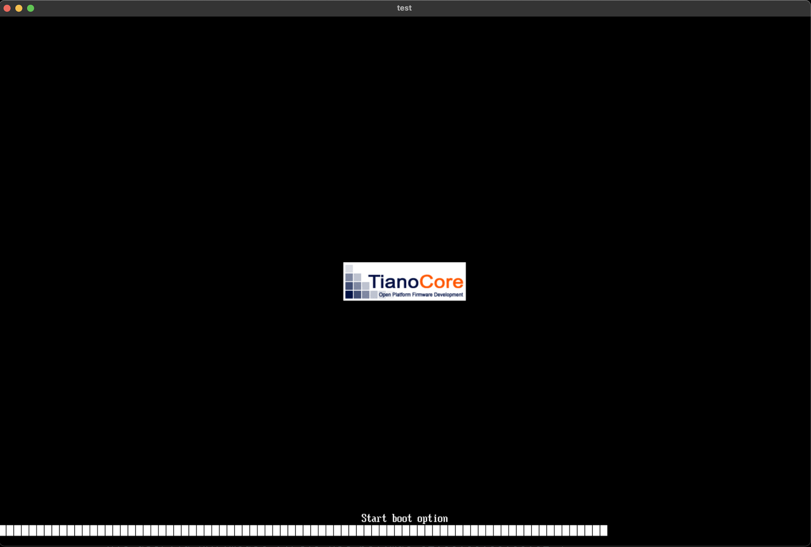
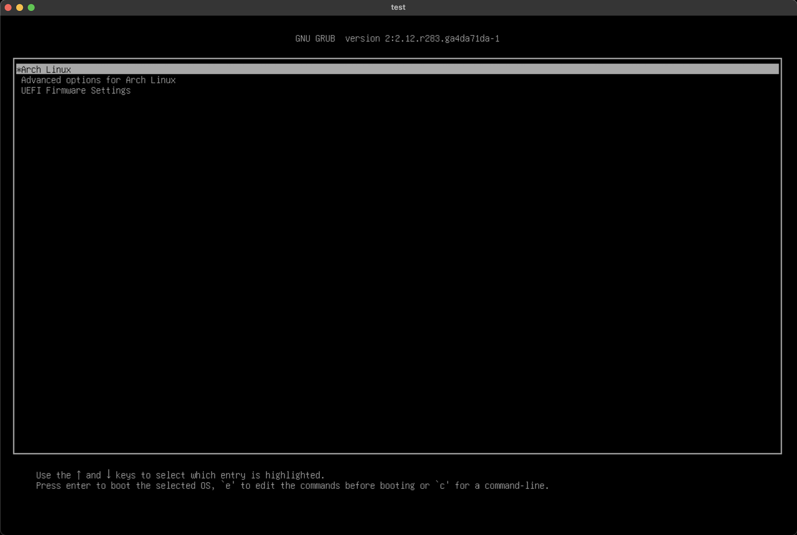
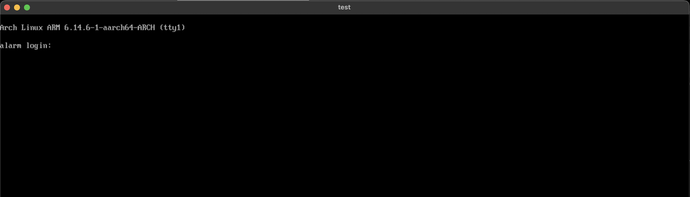
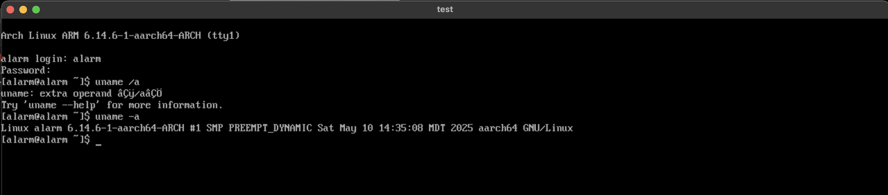

# Arch Linux for ARM (Aarch64) on Lima


Arch Linux for ARM (Aarch64) on Lima


[](https://github.com/mschirrmeister/archlinux-lima/releases)
[](https://github.com/mschirrmeister/archlinux-lima/stargazers)
[](https://github.com/mschirrmeister/archlinux-lima/network)


[](https://github.com/mschirrmeister/archlinux-lima/releases)
 [](https://github.com/mschirrmeister/archlinux-lima/issues)
[](https://github.com/mschirrmeister/archlinux-lima/pulls)

[](https://github.com/mschirrmeister/archlinux-lima/issues)


## Table of Contents
- [Requirements / Prerequisites](#️-requirements--prerequisites)
- [Image Notes](#-image-notes)
- [Quick Start](#-quick-start)
- [Output Directory](#-output-directory)
- [How to use with Lima](#-how-to-use-with-lima)
- [Customize qcow2 image](#-️-customize-qcow2-image)
- [Lima VM start example](#-lima-vm-start-example)
- [Troubleshooting / FAQ](#troubleshooting--faq)
- [Big Ups & Shoutouts](#-big-ups--shoutouts)
- [Pull Up & Contribute](#-pull-up--contribute)
- [License](#license)

## 🛠️ Requirements / Prerequisites

This list includes items that I used to build the image. You can use different versions but I can't guarantee that it will work. But I am pretty sure it will work on other Apple Silicon Macs and also with some slightly older versions of QEMU and Lima.

- Macbook Pro M4
- macOS 15
- Homebrew (to install QEMU, Lima, etc.)
- QEMU 10.0.0
- Lima 1.0.7

Install QEMU and Lima with Homebrew

```shell
brew install qemu lima
```

## 📝 Image notes

User credentials in the image

- `alarm/alarm`
- `root/root`

## ▶️ Quick Start

If you want to build an image yourself, clone the repo and build it locally.

1. Clone this repo on your Mac

   ```shell
   git clone https://github.com/mschirrmeister/archlinux-lima.git
   cd archlinux-lima
   ```

1. Build the image with a Lima VM

   ```shell
   limactl start --name build-arch template://ubuntu
   limactl shell build-arch
   ```

2. Inside the build VM run the `create-image.sh` script

   ```shell
   ./create-image.sh
   exit
   ```

3. Back on your Mac generate a Lima template

   ```shell
   ./create-archlinux-template.sh
   ```

4. Start the VM

   ```shell
   limactl start --name archlinux ./archlinux.yaml
   ```

### 📁 Output Directory

> **Note:**
> All generated image files (such as `.qcow2.xz`, `.qcow2`, `.img`, `.vmdk`) are placed in `/tmp/lima/output/` by default.
>
> - When building inside the Lima build VM, `/tmp/lima/output/` refers to the directory inside the VM.
> - If you have `/tmp/lima` mounted as a writable directory in your Lima template (which is the default for many templates that come with Lima), you can access the same files from your Mac host at `/tmp/lima/output/`.
> - Helper scripts like `create-archlinux-yaml.sh` expect to find images in this directory.
>
> This setup ensures a consistent location for build artifacts, making it easy to find and use your generated images.

## 📦 How to use with Lima

The Arch Linux template that comes with Lima is currently broken for Aarch64. Once the template in Lima itself is updated, you can simply run:

	limactl start --name archlinux template://archlinux

Until this is fixed you can create your own template.

Create a file `archlinux.yaml` with the following content.

	# This template requires Lima v0.7.0 or later
	images:

	- location: "https://github.com/mschirrmeister/archlinux-lima/releases/download/20250513-0/Arch-Linux-aarch64-cloudimg-20250513.0.qcow2.xz"
	  arch: "aarch64"
	  digest: "sha512:6c2dbf4876f4636e9c69a0b3e66d7d9ba1697db23cd3f8437add4bca59dc62007cff13ecb5344084e5704cc5e8666d1864edf95b3fdccf9105d5f0b449db5c55"
	# Hint: run `limactl prune` to invalidate the cache

	mounts:
	- location: "~"
	- location: "/tmp/lima"
	  writable: true

After the template is created you can start the VM with:

	limactl start --name archlinux ./archlinux.yaml

## 🛠️ Customize qcow2 image

In case you want to create a customized image you can start a local VM via **qemu**, do all you changes and use the updated **qcow2** image in a new template.
On a Mac with Apple Silicon (only tested on M4) you can boot a VM with the following command.

	qemu-system-aarch64 \
	    -name "Arch Linux AArch64" \
	    -machine type=virt,iommu=smmuv3 \
	    -accel tcg \
	    -cpu cortex-a72 \
	    -m 2048 \
	    -rtc base=utc \
	    -drive if=pflash,format=raw,file="/opt/homebrew/share/qemu/edk2-aarch64-code.fd",readonly=on \
	    -drive if=pflash,format=raw,file="/opt/homebrew/share/qemu/edk2-arm-vars.fd" \
	    -drive file="Arch-Linux-aarch64-cloudimg-20250510.0.qcow2",if=virtio,format=qcow2 \
	    -boot menu=on \
	    -nic user,id=NAT,model=virtio-net-pci,mac=02:00:00:00:00:01 \
	    -device virtio-gpu-pci \
	    -vnc :0 \
	    -device qemu-xhci \
	    -device usb-kbd \
	    -device usb-tablet

Connect to the VM with a VNC client on `127.0.0.1:5900`. Video and keyboard are working and you should be able to do your customizations. Here are some screenshots.






## 🖥️ Lima VM start example

Here is a Lima VM start example. Full rundown.

```shell
marco@eagle ~/T/lima> time limactl start --name archlinux ./archlinux.yaml
? Creating an instance "archlinux" Proceed with the current configuration
INFO[0001] Starting the instance "archlinux" with VM driver "vz"
INFO[0001] Attempting to download the image              arch=aarch64 digest="sha512:c2bb3e003dd91bb49eb444e1ceeb8a031cd441de34a974f5d883bdc8921595f1b1cfc014c6a2cdf41ff782489a1e9c56b193d2927a137639b35e7656af747f1a" location="http://127.0.0.1:8080/Arch-Linux-aarch64-cloudimg-20250511.0.qcow2.xz"
INFO[0001] decompressing .xz with xz
INFO[0001] Decompressing data
308.98 MiB / 308.98 MiB [---------------------------------] 100.00% 303.81 MiB/s
INFO[0002] Using cache "/Users/marco/Library/Caches/lima/download/by-url-sha256/f34fd42fd59200144fd28dd2a7bcaea344910382547d3726b468b6225e048690/data"
INFO[0002] Converting "/Users/marco/.lima/archlinux/basedisk" (qcow2) to a raw disk "/Users/marco/.lima/archlinux/diffdisk"
4.00 GiB / 4.00 GiB [--------------------------------------------] 100.00% ? p/s
INFO[0002] Expanding to 100GiB
INFO[0002] Attempting to download the nerdctl archive    arch=aarch64 digest="sha256:a2b075ec31a8d9d55d030048ed1dacfc701d306e5207d6452ceffb8889abbc84" location="https://github.com/containerd/nerdctl/releases/download/v2.0.4/nerdctl-full-2.0.4-linux-arm64.tar.gz"
INFO[0002] Using cache "/Users/marco/Library/Caches/lima/download/by-url-sha256/bdcca46253ea68d95c3ef54d1e50c3396b6cb9b3d7297477afa67a69ef0f012a/data"
INFO[0003] [hostagent] hostagent socket created at /Users/marco/.lima/archlinux/ha.sock
INFO[0003] [hostagent] Starting VZ (hint: to watch the boot progress, see "/Users/marco/.lima/archlinux/serial*.log")
INFO[0003] SSH Local Port: 49171
INFO[0003] [hostagent] [VZ] - vm state change: running
INFO[0003] [hostagent] Waiting for the essential requirement 1 of 2: "ssh"
INFO[0013] [hostagent] Waiting for the essential requirement 1 of 2: "ssh"
INFO[0013] [hostagent] The essential requirement 1 of 2 is satisfied
INFO[0013] [hostagent] Waiting for the essential requirement 2 of 2: "user session is ready for ssh"
INFO[0013] [hostagent] The essential requirement 2 of 2 is satisfied
INFO[0013] [hostagent] Waiting for the optional requirement 1 of 2: "systemd must be available"
INFO[0013] [hostagent] Guest agent is running
INFO[0013] [hostagent] Not forwarding TCP 127.0.0.53:53
INFO[0013] [hostagent] The optional requirement 1 of 2 is satisfied
INFO[0013] [hostagent] Not forwarding TCP 0.0.0.0:22
INFO[0013] [hostagent] Not forwarding TCP 127.0.0.54:53
INFO[0013] [hostagent] Waiting for the optional requirement 2 of 2: "containerd binaries to be installed"
INFO[0013] [hostagent] Forwarding TCP from 0.0.0.0:5355 to 127.0.0.1:5355
INFO[0013] [hostagent] Not forwarding TCP [::]:22
INFO[0013] [hostagent] Forwarding TCP from [::]:5355 to 127.0.0.1:5355
WARN[0013] [hostagent] failed to set up forwarding tcp port 5355 (negligible if already forwarded)  error="failed to run [ssh -F /dev/null -o IdentityFile=\"/Users/marco/.lima/_config/user\" -o StrictHostKeyChecking=no -o UserKnownHostsFile=/dev/null -o NoHostAuthenticationForLocalhost=yes -o GSSAPIAuthentication=no -o PreferredAuthentications=publickey -o Compression=no -o BatchMode=yes -o IdentitiesOnly=yes -o Ciphers=\"^aes128-gcm@openssh.com,aes256-gcm@openssh.com\" -o User=marco -o ControlMaster=auto -o ControlPath=\"/Users/marco/.lima/archlinux/ssh.sock\" -o ControlPersist=yes -T -O forward -L 127.0.0.1:5355:[::]:5355 -N -f -p 49171 127.0.0.1 --]: \"\": exit status 255"
INFO[0016] [hostagent] The optional requirement 2 of 2 is satisfied
INFO[0016] [hostagent] Waiting for the guest agent to be running
INFO[0016] [hostagent] Waiting for the final requirement 1 of 1: "boot scripts must have finished"
INFO[0019] [hostagent] Forwarding TCP from 127.0.0.1:33347 to 127.0.0.1:33347
INFO[0029] [hostagent] The final requirement 1 of 1 is satisfied
INFO[0029] READY. Run `limactl shell archlinux` to open the shell.

________________________________________________________
Executed in   29.49 secs    fish           external
   usr time   10.99 secs    0.18 millis   10.99 secs
   sys time    1.75 secs    1.83 millis    1.75 secs


marco@eagle ~/T/lima> limactl shell archlinux

[marco@lima-archlinux lima]$ cat /etc/os-release
NAME="Arch Linux ARM"
PRETTY_NAME="Arch Linux ARM"
ID=archarm
ID_LIKE=arch
BUILD_ID=rolling
ANSI_COLOR="38;2;23;147;209"
HOME_URL="https://archlinuxarm.org/"
DOCUMENTATION_URL="https://archlinuxarm.org/wiki"
SUPPORT_URL="https://archlinuxarm.org/forum"
BUG_REPORT_URL="https://github.com/archlinuxarm/PKGBUILDs/issues"
LOGO=archlinux-logo

[marco@lima-archlinux lima]$ uname -a
Linux lima-archlinux 6.14.6-1-aarch64-ARCH #1 SMP PREEMPT_DYNAMIC Sat May 10 14:35:08 MDT 2025 aarch64 GNU/Linux

[marco@lima-archlinux lima]$ sudo pacman -S fish fastfetch

[marco@lima-archlinux lima]$ fish
Welcome to fish, the friendly interactive shell
Type help for instructions on how to use fish

marco@lima-archlinux /U/m/T/lima> set -U fish_greeting "🐟"
set: successfully set universal 'fish_greeting'; but a global by that name shadows it

marco@lima-archlinux /U/m/T/lima> fastfetch
                  -`                     marco@lima-archlinux
                 .o+`                    ---------------------
                `ooo/                    OS: Arch Linux ARM aarch64
               `+oooo:                   Host: Apple Virtualization Generic Platform (1)
              `+oooooo:                  Kernel: Linux 6.14.6-1-aarch64-ARCH
              -+oooooo+:                 Uptime: 3 mins
            `/:-:++oooo+:                Packages: 176 (pacman)
           `/++++/+++++++:               Shell: fish 4.0.2
          `/++++++++++++++:              Terminal: /dev/pts/0
         `/+++ooooooooooooo/`            CPU: Virtualized Apple Silicon (4)
        ./ooosssso++osssssso+`           Memory: 163.92 MiB / 3.82 GiB (4%)
       .oossssso-````/ossssss+`          Swap: Disabled
      -osssssso.      :ssssssso.         Disk (/): 1.71 GiB / 3.37 GiB (51%) - ext4
     :osssssss/        osssso+++.        Disk (/mnt/lima-cidata): 252.57 MiB / 252.57 MiB (100%) - iso9660 [Read-only]
    /ossssssss/        +ssssooo/-        Local IP (eth0): 192.168.5.15/24
  `/ossssso+/:-        -:/+osssso+-      Locale: en_US.UTF-8
 `+sso+:-`                 `.-/+oso:
`++:.                           `-/+/
.`                                 `/
```

---

## Troubleshooting / FAQ

**Q: I can’t find my image after building—where is it?**
- A: Check `/tmp/lima/output/` on your build VM or your Mac (if `/tmp/lima` is mounted). See the [Output Directory](#-output-directory) section above.

**Q: My Lima VM can’t find the image or says the digest is wrong.**
- A: Make sure you’re referencing the correct file and digest in your `archlinux.yaml`. Update the digest if you rebuild the image.

**Q: I get permission errors accessing `/tmp/lima/output/`.**
- A: Ensure your Lima template has `/tmp/lima` mounted as writable and that your user has access.

**Q: Can I use this on Intel Macs or x86 hosts?**
- A: This image is built for Aarch64/ARM64. QEMU can emulate ARM on x86, but performance will be much lower.

**Q: How do I update QEMU or Lima?**
- A: Use Homebrew: `brew upgrade qemu lima`

If you have more questions, open an [issue](https://github.com/mschirrmeister/archlinux-lima/issues) or start a discussion!

---

## 🙏 Big Ups & Shoutouts

Major props to the OGs and real ones who made this project possible:

- **[Samuel Kwankiu](https://github.com/kwankiu)** and the [archlinux-installer](https://github.com/kwankiu/archlinux-installer) crew — y’all the blueprint, straight up inspiration for this whole hustle.
- **[Arch Linux ARM](https://archlinuxarm.org/)** — holding it down for ARM, keeping it rolling for the community.
- **[Lima](https://github.com/lima-vm/lima)** — for making Linux VMs on Mac a walk in the park, no cap.
- **[QEMU](https://www.qemu.org/)** — the real MVP of virtualization, respect!

And big love to all the upstream maintainers, contributors, and every open source soldier out there. Y’all keep the game moving.

## 🤝 Pull Up & Contribute

Ayo, this project’s open for all!
If you got ideas, fixes, or just wanna chop it up about Arch on Apple Silicon, you in the right spot.

- **Pull Requests:** Got code? Drop a PR, keep it clean, and let’s build together.
- **Issues:** Something broke? Got a question? Throw it in the issues—no dumb questions here.
- **Discussions:** Wanna vibe about setups, Lima tricks, or just flex your config? Start a thread, let’s get it.

New to open source? Don’t trip—every contribution counts, and I got your back if you need help with your first PR.
Let’s make this repo legendary, together!


## License

This project is licensed under the MIT License. See the [LICENSE](LICENSE) file for details.
